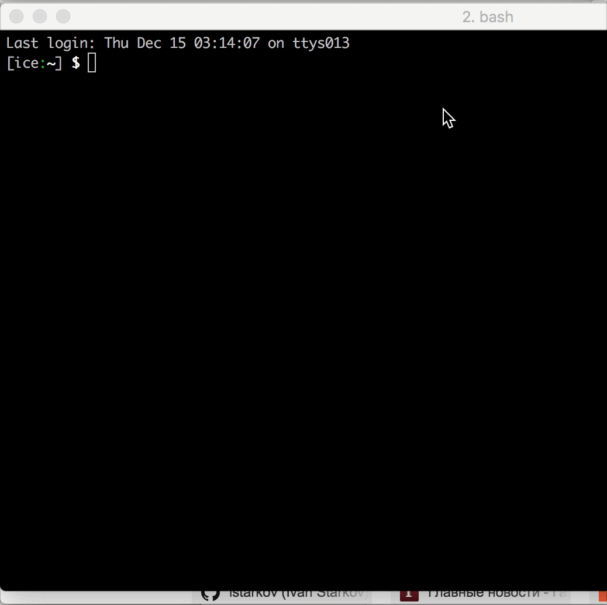

# stdind

Wraps base64 encoded output of any command and allow it to be accessed via a WebSocket.

Also starts a web app on 4000 (default) port with full featured terminal window,
and shows all output in browser as in ordinary terminal app.

## Install

```bash
npm install --global stdind
```

## Usage example


```bash
npm install --global pty64
pty64 --base64 -- {long running process with output 2 stdout} | stdind
```

Open localhost:4000 and see terminal output.
Be sure server will be closed at "long running process" end

To not close server at the process end just add `--always` argument

```bash
pty64 --base64 -- {long running process with output 2 stdout} | stdind --always
```

To send only realtime data

```bash
pty64 --base64 -- docker stats | stdind --realtime
```

PS:
As a long running example you can use provided `stdind-long-running-example`.

```bash
pty64 --base64 -- stdind-long-running-example | stdind --always
```



## Contribute

Clone project, to see example run

```
npm install
npm run build
npm run start:server
```

open localhost:4000 to see it in action,

To develop client part, run `npm run start`,
open localhost:3000 to see it in action
